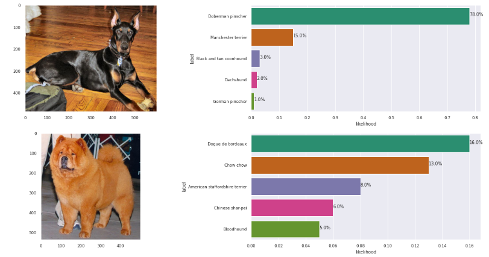

[//]: # (Image References)

[image1]: ./images/sample_dog_output.png "Sample Output"
[image2]: ./images/vgg16_model.png "VGG-16 Model Layers"
[image3]: ./images/vgg16_model_draw.png "VGG16 Model Figure"

## Dog Breed Classifier

![Sample Output][image1]

## Datasets

1. [Dog dataset](https://s3-us-west-1.amazonaws.com/udacity-aind/dog-project/dogImages.zip).  
2. [Human dataset](http://vis-www.cs.umass.edu/lfw/lfw.tgz).   

## Results

